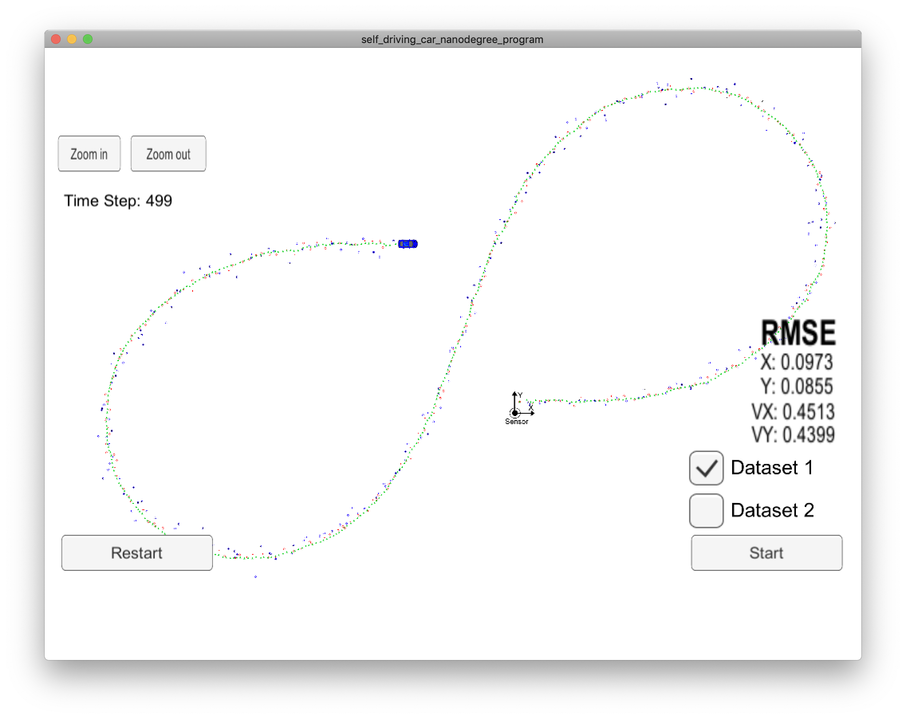
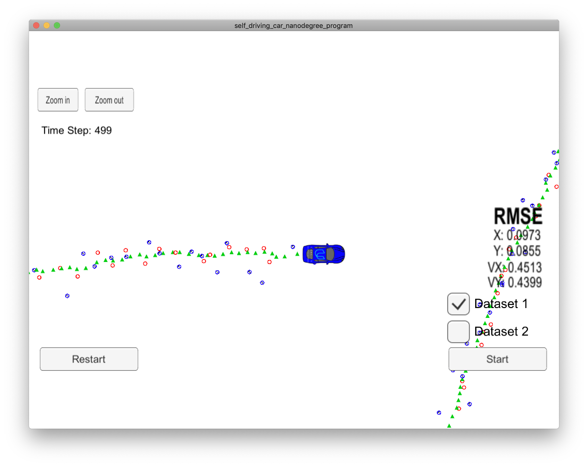

#  Extended Kalman Filter Project

This project implements a rudimentary sensor fusion module which estimates the position of a vehicle (2d, top-down) from mock Lidar and Radar sensor data. The fusion module includes an implementation of   a standard (linear) Kalman filter to handle Lidar data and a linearized (extended) Kalman filter to handle Radar data. The RMSE metric is used to evaluate estimator performance. 





## Data

__`./data/obj_pose-laser-radar-synthetic-input.txt`__

```
L	3.122427e-01	5.803398e-01	1477010443000000	6.000000e-01	6.000000e-01	5.199937e+00	0	0	6.911322e-03
R	1.014892e+00	5.543292e-01	4.892807e+00	1477010443050000	8.599968e-01	6.000449e-01	5.199747e+00	1.796856e-03	3.455661e-04	1.382155e-02
...
```

- timestamp is in microseconds
- radar data is in polar coordinates


## Resources

- [kalman filter - wikipedia](https://en.wikipedia.org/wiki/Kalman_filter)
- [RMSE - wikipedia](https://en.wikipedia.org/wiki/Root-mean-square_deviation)
- [project rubric](https://review.udacity.com/#!/rubrics/748/view)
- [starter code](https://github.com/udacity/CarND-Extended-Kalman-Filter-Project)
- [simulator](https://github.com/udacity/self-driving-car-sim/releases/)
- [visualization tools](https://github.com/udacity/CarND-Mercedes-SF-Utilities)
- [Q&A video](https://www.youtube.com/watch?v=J7WK9gEUltM&feature=youtu.be)
- [uWebsockets Library](https://github.com/uNetworking/uWebSockets)
- [Eigen Library](http://eigen.tuxfamily.org/index.php?title=Main_Page)
- [JSON Library](https://github.com/nlohmann/json)
- [Google C++ Style Guide](https://google.github.io/styleguide/cppguide.html)
- [C++ Core Guidelines](https://github.com/isocpp/CppCoreGuidelines/blob/master/CppCoreGuidelines.md)

### Reference Projects

* https://github.com/mherb/kalman
* https://github.com/igormiktor/arduino-EventManager/blob/master/EventManager/EventManager.h
* https://github.com/id-Software/DOOM-3-BFG/blob/master/neo/renderer/ModelManager.h


